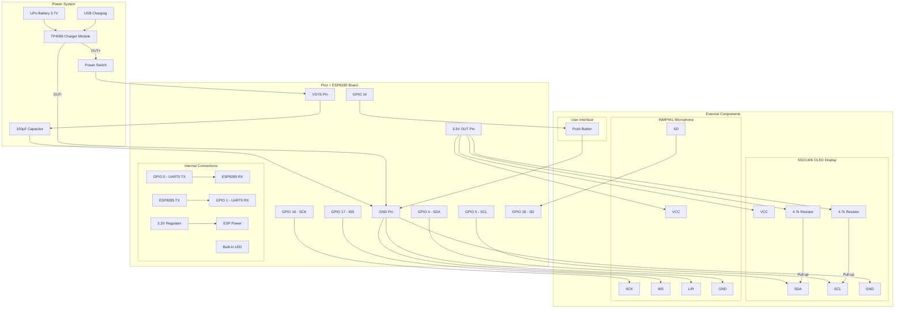

# Glasses Speech-to-Text Schematic

This document outlines the hardware connections for the Glasses Speech-to-Text system.

## System Overview

- **MCU**: Raspberry Pi Pico (RP2040)
- **WiFi**: ESP8285 (via UART)
- **Audio Input**: INMP441 MEMS Microphone (I2S)
- **Display**: SSD1306 OLED 0.96" (I2C)
- **Input**: Push Button (GPIO)
- **Status**: Built-in LED (GPIO 25 or 'LED')

## Bill of Materials (BOM)

| Item | Description | Quantity | Notes |
|------|-------------|----------|-------|
| **Pico + ESP8285** | Raspberry Pi Pico clone with onboard ESP8285 | 1 | "Pico W" clone style |
| **INMP441** | MEMS Microphone Module (I2S) | 1 | High quality digital audio |
| **SSD1306** | 0.96" OLED Display (I2C) | 1 | 128x64 pixels |
| **Battery** | 3.7V LiPo Battery (e.g., 600mAh+) | 1 | Connector: JST-PH 2.0 usually |
| **Charger** | TP4056 USB Charger Module | 1 | With protection circuit preferred |
| **Switch** | SPDT Slide Switch | 1 | For power On/Off |
| **Button** | Momentary Push Button | 1 | 6x6mm tactile switch |
| **Resistors** | 4.7kΩ (Optional) | 2 | For I2C Pull-ups (if OLED lacks them) |
| **Capacitor** | 100µF (Optional) | 1 | Across VSYS/GND for power stability |
| **Wires** | Jumper wires / Silicone wire | - | For connections |

## Pinout Table

| Component | Pin Name | Pico Pin | Description |
|-----------|----------|----------|-------------|
| **ESP8285** | TX | GPIO 1 (UART0 RX) | UART Receive |
| | RX | GPIO 0 (UART0 TX) | UART Transmit |
| | VCC | 3.3V (OUT) | Power |
| | GND | GND | Ground |
| **INMP441** | SCK | GPIO 16 | I2S Serial Clock (BCLK) |
| | WS | GPIO 17 | I2S Word Select (LRCLK) |
| | SD | GPIO 18 | I2S Serial Data (DOUT) |
| | VCC | 3.3V (OUT) | Power |
| | GND | GND | Ground |
| | L/R | GND | Channel Select (Left) |
| **SSD1306** | SCL | GPIO 5 | I2C Clock (SoftI2C) |
| | SDA | GPIO 4 | I2C Data (SoftI2C) |
| | VCC | 3.3V (OUT) | Power |
| | GND | GND | Ground |
| **Button** | Signal | GPIO 14 | Active LOW (Pull-up) |
| | GND | GND | Ground |
| **LED** | - | Built-in | Status Indicator |

> **Note:** The ESP8285 on some Pico clones is internally connected to UART0 (GPIO 0/1). If using an external ESP8285 module, wire as above.

## Schematic Diagram

## Wiring Notes

1.  **I2C Pull-ups**: The SSD1306 OLED usually has built-in pull-up resistors. If not, add 4.7kΩ resistors from SDA and SCL to 3.3V.
2.  **Microphone Channel**: Connecting L/R to GND selects the Left channel. Connecting to VCC selects Right. Our code uses Mono (Left).
3.  **Power Supply**: Ensure your 3.3V source can supply enough current (~300mA peak) for the ESP8285 WiFi transmission. The Pico's onboard regulator is usually sufficient.
